# **_Hangman - Portfolio Project 3_**

This document contains all the issues necessary to create and develop the game Hangman in Python. Here is the link to the game [Hangman](https://css-angie-hangman-0ba92329c737.herokuapp.com). The website is a part of the course “Full Stack Software Development” at Code Institute and showcases the knowledge I have gained so far.

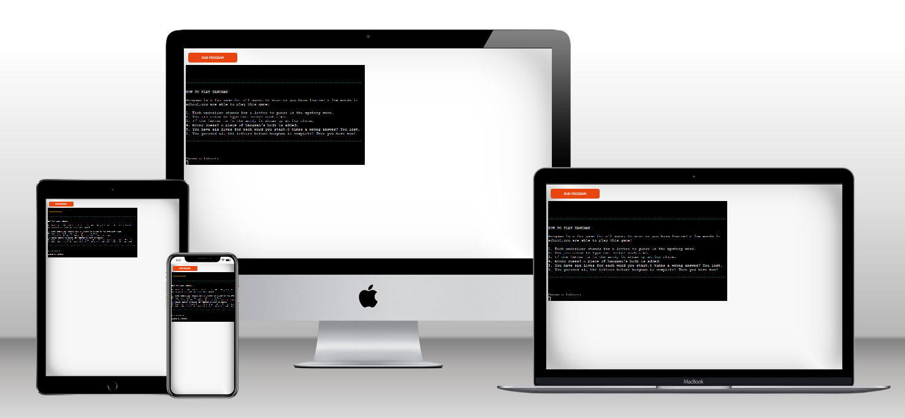

# Table of content

- [The objective of the game](#the-objective-of-the-game) 
  - [How to play hangman](#how-to-play-hangman)
- [The UX part of creation](#the-ux-part-of-creation) 
- [Basic Setup](#basic-setup) 
  - [Setup of the repository](#setup-of-the-repository) 
  - [External sources](#external-sources) 
- [Features](#features) 
  - [Hero section](#hero-section)
  - [Main Section](#main-section) 
  - [Footer](#footer) 
- [Technology used](#technology-used) 
  - [Languages](#languages) 
  - [Other libraries and programs](#other-libraries-and-programs)  
- [Deployment](#deployment) 
- [Testing](#testing) 
  - [Manual testing](#manual-testing) 
  - [Bugs](#bugs)
- [Future features](#future-features) 
  - [Timer](#timer) 
  - [More words in several categories](#more-words-in-several-categories) 
  - [Scoreboard](#scoreboard) 
- [Credits](#credits) 
  - [Sources used to write the website](#sources-used-to-write-the-website) 
  - [Words](#words) 
  - [Fonts](#fonts) 
  - [Colours](#colours) 
- [Acknowledgements](#acknowledgements) 

# The objective of the game

Though the game could be entertaining for any age, Hangman is a great form of edutainment. Young children can guess the new words they have just learned by starting with simple words, gradually offering more complex words as their knowledge grow.
That is why different categories are a nice-to-have feature for future roll-outs.

## How to play hangman

1. Each underline stands for a letter to guess in the mystery word.
2. You are asked to type one letter each time.
3. If the letter is in the word, it shows up at its place.
4. Wrong guess? A piece of hangman's body is added.
5. You have six lives for each word you start. 6 times a wrong answer? You lost.
6. You guessed all the letters before hangman is complete? Then you have won!

The primary target groups in this case are:
- Schoolchildren -  At school and at home this game is a great supplement for teachers and parents to try and test new words with their kids. As the game is quite uncomplicated, children are able to play and practise for themselves as well  

- Schools – giving teachers the opportunity to fill in new words, it will be easy for them to prepare homework or lessons.
- Parents – see Schools.

[Back to top](#table-of-content)

# The UX part of creation

## Creating user stories

<b>User Story 1: As a player I want to practice my words in a playful way </b>

 Acceptance criteria:
- The site looks inviting to play a game of Hangman
- I can continue to play as long as I want

Tasks:
- Design an attractive layout 
- Create a replay loop to replay
- Offer a range of words

<b>User-Story 2: As a parent I want to have no ado and see the child play the game indepently.</b>

 Acceptance Criteria:
- The game does not require much knowledge to play
- Instructions are clear
- Everything is shortly explained, but nothing looks overcrowded 

Tasks:

- Game can be played as soon as page opens 
- A short explanation makes clear how to play the game
- During the game it is clear what must be done

<b>User Story 3: As a teacher I want to add words, but I have no knowledge of coding, so it must be very easy to make changes for me.</b>

 Acceptance criteria:
- There is a file where words can be added and deleted
- The program will not need any changes to make use of the file

Tasks:
- Create a separate file for the words where words can be exchanged easily without having any impact on the code and/or game

[Back to top](#table-of-content)

## Designing the layout and structure

The needs of the game are (not necessarily in logical order) listed here:
- start with a number of lives
- choose a random word from the words file and show the places of the total number of letters
- let words all be uppercase
- let the player choose a letter for the word and make it uppercase
- make sure it is just a letter - return a wrong message if a non-letter was typed
- if letter is right fill out letter in the right place
- show the word and leave the places with not guessed letters blank
- if letter is wrong give a message it is wrong
- if the letter is wrong decrease the numbers of live and display an extra limb on the hangman
- end the game after the number of lives is 0 / hangman full OR if no letters are left to guess
- print a message with the results

To get a better understanding of the flow of the game this is visualized in a flowchart:

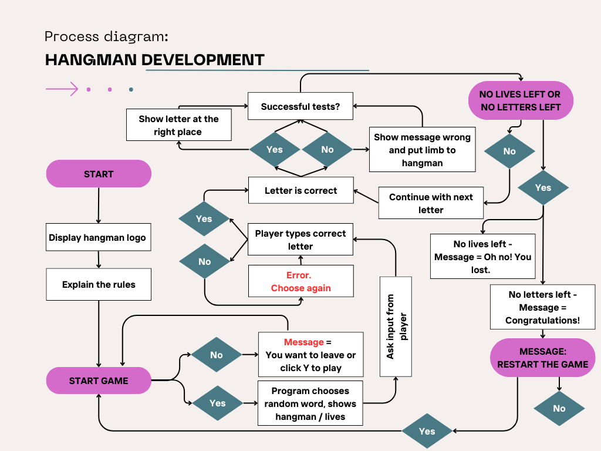

[Back to top](#table-of-content)

# Basic Setup

## Setup of the repository

The basic setup starts with setting up the repository for the project in GitHub. Within it creating a project board and filling the board with the user stories and their requirements with the subsequent tasks, labelling every task in the to-do section with must-have, should-have, and could-have.
For this repository a template is used from Code Institute to make sure all necessary files are in the folder.
Separately three files named requirements.txt, hangman.py and words.py are created for this project. After reading the deployment requirements, the contents of hangman.py were put in the run.py file and hangman.py was deleted.

## External sources
External sources used in this project are mentioned in requirements.txt:
  - colorama==0.4.6
  - pyfiglet==1.0.2
These are imported at the common places.

The setup is checked and deployed and ready to be filled with all features.

[Back to top](#table-of-content)

# Features

## Hero section

The hero section has the name hangman written in the font 'big' from pyfiglet in de colour lightcyan_ex from colorama.
Underneath a full hangman is displayed and the words * *‘oh oh!’* * in the colour yellow from colorama.
Both are shown in a quest to attract the user playing the game.

Unfortunately during deployment a bug appeared. The font of pyfiglet does not show the upper- and underline in the heroku-app.
First screenshot is from the heroku-app. Second screenshot is made from command VSCode. 

Screenshots of the hero section

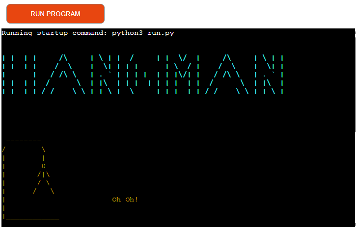
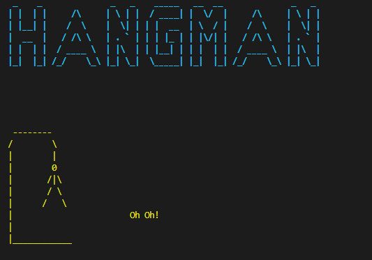

 
To be sure the rules of the game are clear, these are written out in 6 bullet points between coloured separation lines as an indication that it is not a part of the game.
 
Screenshot of the hangman rules
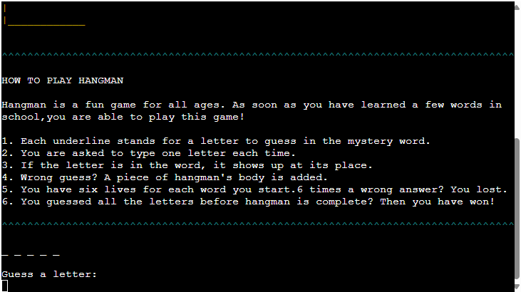

## Main section

The main section content is where the game is played.
First hint are the number of underscores displayed.
Second we find the command: “Guess a letter:”. Here the input of the player is asked.
After typing something, several reactions could pop up:
-	If typing more than one letter * *“Please, choose one letter at a time”* *
-	If typing anything, that does not belong to the alphabet: * *“Please, choose a letter”* *
-	After typing a wrong letter * *“This letter is not in the word.”* * + the hangman in red showing an extra limb
-	After typing a letter that is within the word to guess: The word to guess with the letter at the right place + the hangman in white, as nothing new is added to the hangman
Third and continuing is the repetition of the second part, until the word is guessed OR the player ran out of lives.

Screenshot of the start of the game

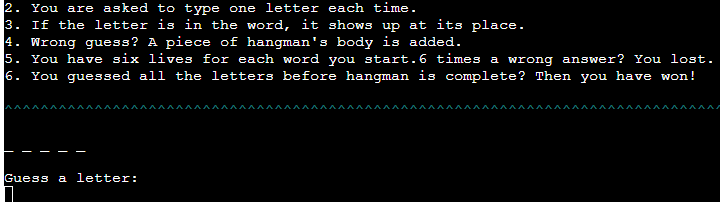

Screenshot of guessing a wrong letter and a right letter

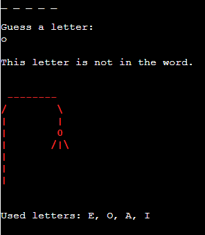
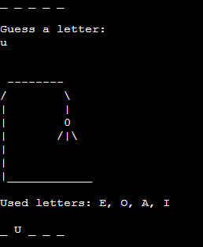

  
In the main section appeared a bug as well during deployment.
This time a piece of code was not displayed i.e. the bottom line of the hangman.

Screenshots of the bug

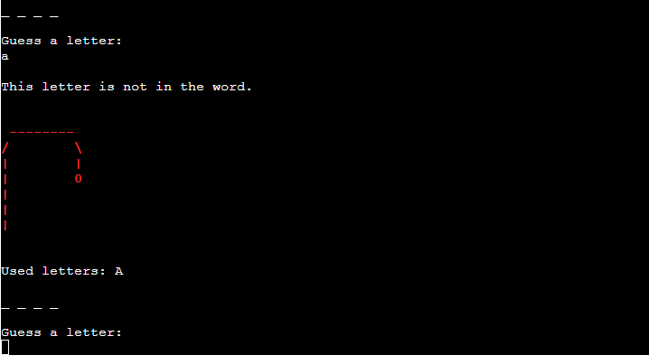
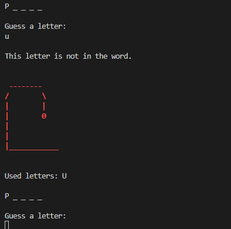

## Footer

The footer will emerge as soon as the game is over and the player lost or won by guessing the word right or not.

If the player wins a large message appears with the word the player guessed. The text of the correct word is displayed in the colour yellow from colorama and font "big" from pyfiglet.
Underneath the word is the folowing text displayed:
* *Congratulations! You won! 
Do you want to start a new game? 
Click Y for Yes or N for No:* *

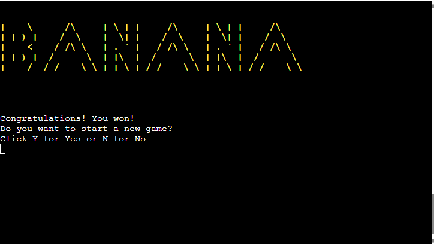

In case the player does not guess the word, the text is in normal font, in a try not to discourage the player from trying again.  
The text includes the word that should have been guessed as well.
* *Oh oh! You hang. The word to guess was PRODUCER 
Do you want to start a new game? 
Click Y for Yes or N for No:* *

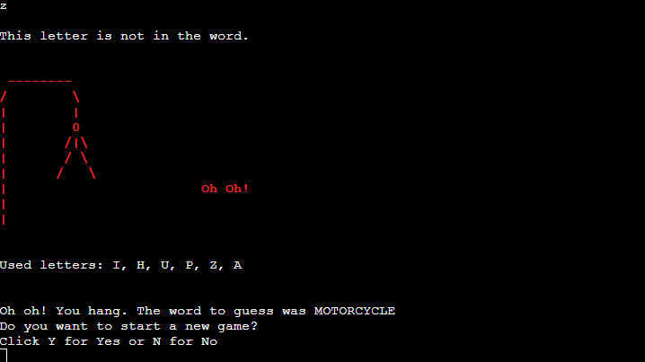

The player has three options to type in the console:  the Y or N or none of both. 
If the Y is pressed, a new game appears in a clear window. 
If N is pressed, a message is displayed: * *Thank you for playing! See you back soon!* * 
If nor the Y or N is pressed, the game ends without any action

Screenshots of the actions made after the decision of a player to continue or not

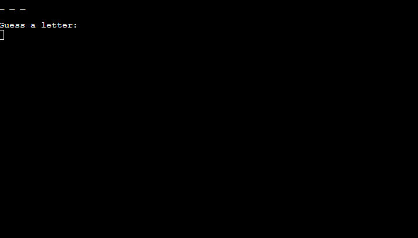
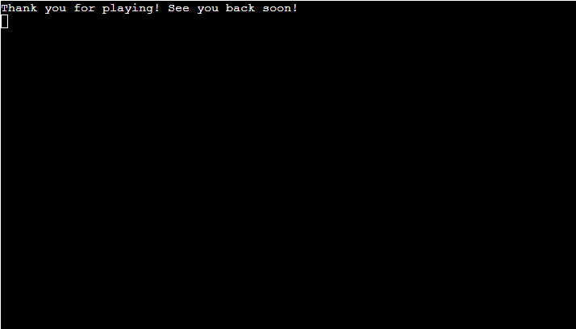

# Technology used

## Languages:

- Python

## Other libraries and programs:

- OS - to clear the window at several points
- Random – for randomizing the words
- Colorama for adding colour to the screen [Colorama]( https://pypi.org/project/colorama/)
- Pyfiglet for some ASCII-Art [Pyfiglet]( https://pypi.org/project/pyfiglet/)
- Canva for creating the flowchart [Canva](https://www.canva.com)
- VS Code for writing code
- Project Overview [GitHub](https://github.com/)
- Heroku  [Deployment](https://www.heroku.com)
- ChatGTP for creating a list of 100 random words to use in the game of Hangman[ChatGPT](https://chatgpt.com)

A screenshot of the prompt and the result here:

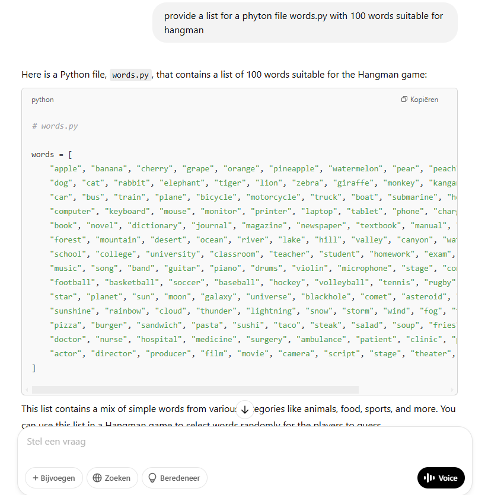

[Back to top](#table-of-content)

# Deployment

Deployment was done with Heroku through GitHub.

To deploy the code the following steps are taken:

1. The code was saved with the commands git add . + git commit -m "message" and pushed to GitHub repository with the command git push.
2. Log in in GitHub.
3. Create account at heroku.com and log in.
4. Click on "Create new app" button to add a project. 
5. Choose an app name and location and click on the button "create app"
6. Go to "Settings" and navigate to Config Vars. Add the following config variable:

    PORT : 8000
7. Navigate to Buildpacks and add buildpacks; first Python and second NodeJS (in this specific order).
8. Next choose the deployment method GitHub, enter th repository name and connect - the message "App connected to GitHub" appears
9. Scroll down to Manual deploy, select main branch and click the button "Deploy Branch"
10. Deploy to Heroku will be checked and with the message "Your app was succesfully deployed" the View button shows up.
11. Clicking on the view button takes you to the deployed app.
-----------------------------------------------------------------------------

[Back to top](#table-of-content)

# Testing

Several tools were used to test the website comprehensively. Validating the Python Code was done with PEP8 [PEP8-validator]( https://pep8ci.herokuapp.com).
Several issues were found which were all about the layout of the text (i.e. “line too long” and “expected 2 blank lines after class or function definition, found 1” and “E128 continuation line under-indented for visual indent”).

After correcting the layout (halving lines, giving enters, set the right indent) and testing a second time, all is clear and no errors are found anymore.

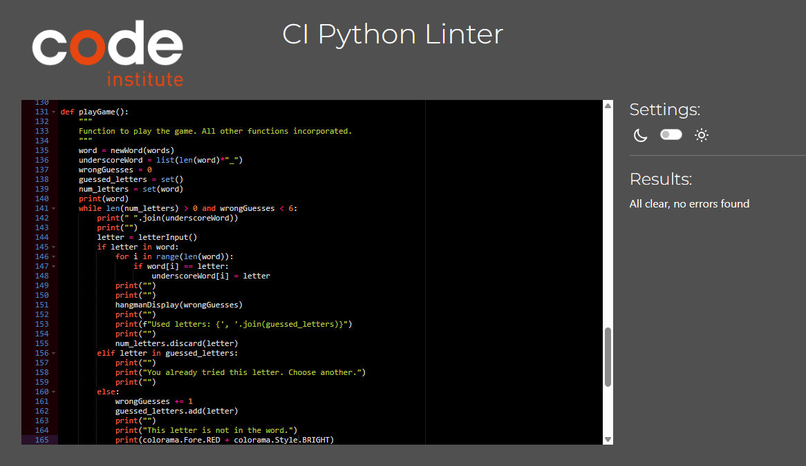

## Manual testing 

| Acceptance criteria | Expected behaviour | Pass or Fail |
| :--------------------------------------------------------------------------------------------------- | :----------------------------------------------------------------------------------------------------------------------------------- | :----------: |
| - The site looks inviting to play a game of Hangman | The somewhat boring command window has been cheered up with colours and different fonts for title and win  |     Pass     |
| No long stories, but a fast way to start the game | After filling out your name, you can start right away |     Pass     |
| I can continue to play as long as I want | The program contains a replay loop and one hundred random words |     Pass     |
| The game does not require much knowledge to play | The only action of the player is choosing a letter |     Pass     |
| Instructions are clear |  A short explanation in 6 steps at the beginning of the game clarifies the course of the game |     Pass     |
| Everything is shortly explained, but nothing looks overcrowded | During the game the player is explained what action is expected, how many lives are left and which letters have been guessed already. Most important, if a letter is guessed it will be displayed at the right position within the word |      Pass     |
| There is a file where words can be added and deleted | In a separate file words can be exchanged very easily |     Pass     |
| The program will not need any changes to make use of the file | As the words can be exchanged in a separate file the code for playing the game remains untouched |     Pass     |
| Only alphabetical characters are excepted as input | An error message appears and asks for a letter (screenshot) |     Pass     |
| Only one letter is excepted as input | An error message appears and asks for one letter at a time (screenshot) |     Pass     |
| If a wrong letter is already used the player is warned | A message appears saying the letter was tried already and asks for another letter (screenshot) |     Pass     |
| To support the player a list of used letters is seen above the word to guess | The list with used letters is shown (screenshot 2) |     Pass     |
| If a letter is correct, no lives are subtracted | Instead of a red hangman a white hangman appears with the exact same parts as before (screenshot 3 and 4) |     Pass     |
| Check if one hangman part is added at a time | All numbers of letters are corresponding to the numbers of hangman pieces |     Pass     |
| If letter is wrong a red hangman appears | Hangman is red when the input contains a wrong letter |     Pass     |
| If letter is correct a white hangman appears | Hangman is white when input contains a correct letter |     Pass     |

Screenshot 1 - typos check

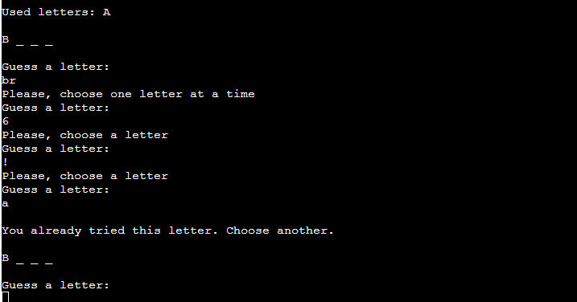

Screenshot 2 - display of used letters

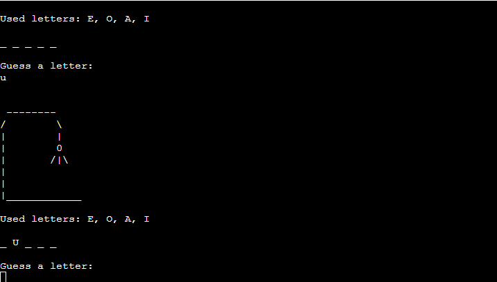

Screenshots 3 and 4 - lives check

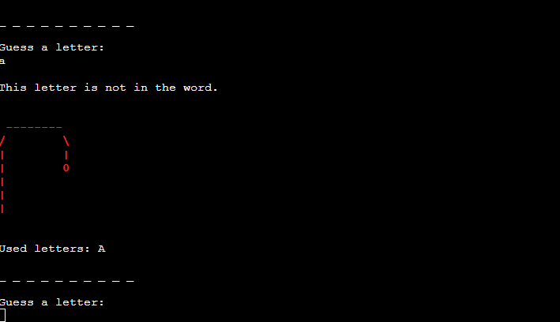
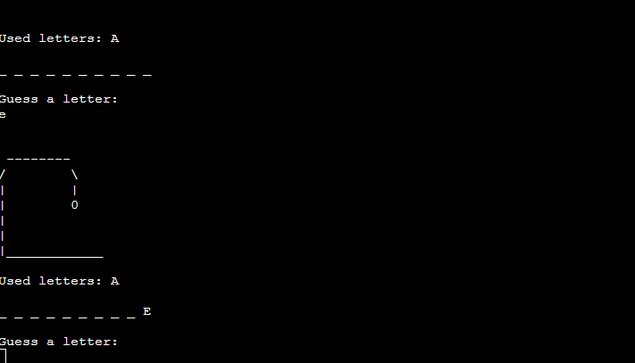

## Bugs

As mentioned before in the README two bug were found. Though displayed correctly in VS Code, several lines are not shown in the Heroku app. Top and bottom line of the font "big" of pyfiglet and the bottom line of the hangman in the colour red have disappeared in the app. 
This is probably a bug in the Heroku app and difficult to fix. Only possible option left is leaving out pyfiglet and colorama. But as this will give quite a dull styling, the bug is taken for granted.

# Future features

The website is just a start of a website, that can be expanded excessively. There are several features to build in, that would definitely be an upgrade to the website.

## Timer

Hangman can be very addictive. To make sure the schoolchildren won’t play all afternoon a timer can be set with a maximum of 60 minutes. The advice will be to set the timer on 30 minutes. After these 30 minutes the game is locked and can only be started again on the next day.

## More questions in several categories

As it should be possible to play the game in all grades, there will be a huge need for different words within different categories. Playing hangman in the first grade should be a lot easier than playing hangman in the fifth grade. And as you want the children to learn the newly learned words, the choice of letters should be adjusted accordingly. 

## Scoreboard

How many words did you guess on a single day? Are you making progress? Are you stable in guessing approximately the same number of words every day? For teachers this is a source of help to screen the progress of their schoolchildren.

# Credits

## Sources used to write the website

- Code Institute Course Content was very helpful for creating this website.
- For coding the displayed hangman I watched the video of [JakeEh]( https://www.youtube.com/watch?v=1c540LVoLoY)
- For the explanation of a string/dictionary without brackets [Geeks for Geeks]( https://www.geeksforgeeks.org/python-string-join-method/?ref=header_outind
)

## Words

The words were generated with [ChatGPT]( https://chatgpt.com)

## Fonts

The fonts of pyfiglet were installed as instructed on [Pypi](https://pypi.org/)

## Colours

The colours of colorama  were installed as instructed on [Pypi](https://pypi.org/)

[Back to top](#table-of-content)

# Acknowledgements

Gareth McGirr, my mentor, for all his help, tips and advice throughout the project. 
Kristyna Wach, my tutor, for taking of me and keeping me motivated.

[Back to top](#table-of-content)
